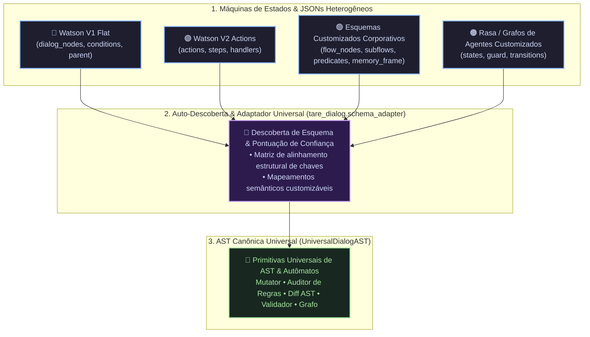
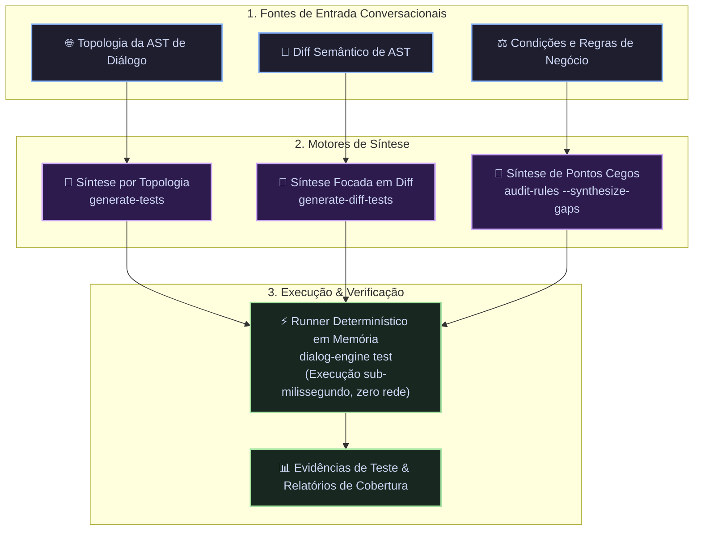
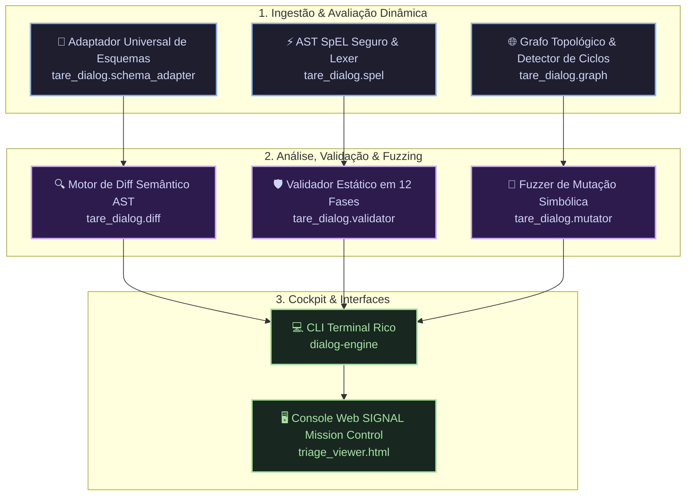

<div align="center">

# tare.tools — Dialog Engine

**Árvore de Sintaxe Abstrata (AST) Conversacional Determinística, Motor de Diff Semântico, Avaliador SpEL Seguro, Analisador de Grafos Topológicos, Fuzzer Simbólico por Mutação, Adaptador de Esquemas Desacoplado e Console Mission Control de Triagem para Diálogos e Árvores de Conversação Corporativas.**

[](https://opensource.org/licenses/Apache-2.0)
[](https://python.org)
[](#performance-e-arquitetura)
[-success.svg)](#testes-automatizados)
[](#estratégia-de-distribuição-dupla)
[](https://augusto-scarvalho.github.io/tare.tools.dialog-engine/)

<p align="center">
  🌐 <b>Idiomas:</b> <a href="README.md">🇺🇸 English (en-US)</a> | <b>🇧🇷 Português (pt-BR)</b>
</p>

<p align="center">
  <a href="#por-que-o-dialog-engine">Por que o Dialog Engine?</a> •
  <a href="#adaptador-universal-de-esquemas--desacoplamento-total">Adaptador Universal</a> •
  <a href="#exemplos-práticos-do-mundo-real-o-que-resolvemos">Exemplos do Mundo Real</a> •
  <a href="#geração-automática-de-testes--curadoria">Geração de Testes & Curadoria</a> •
  <a href="#catálogo-de-funcionalidades--benefícios">Funcionalidades</a> •
  <a href="#taxonomia-de-validação-em-12-fases">Taxonomia de Validação</a> •
  <a href="#referência-de-comandos-cli">Referência da CLI</a> •
  <a href="#api-da-biblioteca-python">API Python</a> •
  <a href="#console-mission-control-html">Console SIGNAL</a>
</p>

</div>

---

## Por que o Dialog Engine? (A Mudança de Paradigma)

Sistemas de IA Conversacional corporativos (IBM Watson Assistant, árvores de diálogo legadas e grafos de agentes) são máquinas de estado não lineares e profundamente aninhadas, contendo milhares de nós, condições dinâmicas em *Spring Expression Language* (SpEL), slots multi-turnos e digressões recursivas.

Ferramentas tradicionais de diff baseadas em texto (`git diff`) e comparadores de JSON ingênuos falham catastroficamente por três motivos estruturais:

1. **Ruído de Falsos Positivos:** A simples reordenação de chaves JSON ou movimentação de nós irmãos gera milhares de linhas de conflitos falsos.
2. **Cegueira para Expressões SpEL Dinâmicas:** Erros de sintaxe, branches inalcançáveis, contradições de tipo e condições sombreadas passam despercebidos até o momento da execução em produção.
3. **Escala e Colapso de Digressão:** Árvores corporativas massivas (mais de 28.000 nós, JSONs de 80 MB+) esgotam a memória RAM durante o parsing DOM ingênuo, enquanto digressões recursivas corrompem o estado da conversa.

```text
DIFF TRADICIONAL INGÊNUO (Ruído de Chaves & Falsos Positivos)
[Nó A (linha 40)] <--- Caos de Diffs ---> [Nó A (linha 1200)]  [!] Reordenação de chaves cria conflitos inexistentes.

MOTOR DE AST DETERMINÍSTICO DO DIALOG ENGINE (Preservação de Invariantes Semânticos)
   +---> [Intent: #transferencia] ---> [Slot: $valor (@sys-number)] ---> [Condição: $valor > 0]
   |                                                                                │
[Raiz da Árvore] ----------------- (Binding por UUID Determinístico) -------------> [Nó de Sucesso]
   |                                                                                ▲
   +---> [Digressão: #ajuda] --------> (Preservação de Pilha / Retorno) ------------+
```

---

## Adaptador Universal de Esquemas & Desacoplamento Total (`SchemaBinding`)

O Dialog Engine é **100% agnóstico de formatos proprietários e nomes de chaves JSON**. Através do módulo `tare_dialog.schema_adapter` ([ADR-0006](docs/adr/0006-universal-schema-binding-and-state-machine-adapter.md)), o motor descobre e alinha dinamicamente qualquer máquina de estados conversacional para a **Árvore de Sintaxe Abstrata (AST) Canônica**:



### Auto-Descoberta Semântica em Código:
```python
from tare_dialog import SchemaBinding

# 1. Descoberta Automática de Esquema com Pontuação de Confiança
binding = SchemaBinding.discover(meu_json_desconhecido)
print(f"Esquema: {binding.schema_name} (Confiança: {binding.confidence_score * 100}%)")

# 2. Navegação Agnóstica de Nós (Nenhum campo hardcoded!)
for node in binding.iter_all_nodes(meu_json_desconhecido):
    node_id = binding.get_id(node)
    cond = binding.get_condition(node)
    ctx = binding.get_context(node)
```

---

## Exemplos Práticos do Mundo Real (O que Resolvemos)

Para entender como o **Dialog Engine** protege assistentes em bancos, seguradoras e telecomunicações, veja **5 casos reais** onde ferramentas comuns falham e como o nosso motor atua:

---

### 🚨 Exemplo 1: O "Bug Silencioso" de Limite de Crédito (Mutação & Ponto Cego)

* **O Cenário:** Um bot bancário analisa score para aprovar aumento de limite de cartão.
* **O Código no Nó de Diálogo:**
  ```json
  {
    "dialog_node": "node_credit_underwriting",
    "context": {
      "limit_evaluation": "<? ($user_score >= 750 && $account_months > 6) ? 'approved' : 'analysis' ?>"
    }
  }
  ```
* **A Falsa Segurança dos Testes:** O time de QA tem 5 testes automatizados (consultar saldo, ver fatura, pedir ajuda). Todos passam (100% verde).
* **O que o Mutador de Regras (`dialog-engine audit-rules`) faz:**
  1. O motor **inverte a lógica** do nó: muda `>= 750` para `< 750` (negando o bom pagador e aprovando o mau pagador!).
  2. Roda a suíte de testes do cliente contra o bot mutado.
  3. **Resultado:** Todos os 5 testes continuam passando!
  4. **O Alerta do Engine:** 
     `[🔴 RISCO FINANCEIRO] Ponto Cego Detectado: Nenhum teste existente valida a regra de crédito em node_credit_underwriting!`
* **A Solução Automática:** Com a flag `--synthesize-gaps`, o engine **gera sozinho o arquivo de teste que faltava**:
  ```json
  {
    "id": "gap_test_credit_score_high",
    "name": "[Auto-Synthesized] Validar Aprovação de Limite com Score Alto",
    "turns": [
      {
        "input": {"text": "quero aumentar meu limite", "context": {"user_score": 800, "account_months": 12}},
        "expected": {"node": "node_credit_underwriting"}
      }
    ]
  }
  ```

---

### 🚨 Exemplo 2: A Pegadinha do Slot com Número Zero (Validação Estática 12-Fases)

* **O Cenário:** O bot de pesquisa de satisfação pergunta ao cliente:
  > *"Em uma escala de 0 a 10, qual a chance de você nos indicar?"*
* **A Condição configurada no Slot:**
  ```json
  {
    "variable": "$nps_score",
    "conditions": "@sys-number > 0"
  }
  ```
* **O Problema em Produção:** O texto do prompt aceita `0`, mas a condição de captura `@sys-number > 0` **ignora o número zero**.
  - Quando o cliente insatisfeito digita `0`, o bot entra em loop repetindo: *"Desculpe, não entendi. Digite de 0 a 10"*. O cliente se irrita e desiste.
* **Como o Dialog Engine resolve:**
  A **Fase 4** (`sys_number_zero_not_captured`) audita simultaneamente o prompt em linguagem natural e a AST de condições, emitindo o alerta antes do deploy:
  ```text
  [⚠️ SEMANTIC WARNING] slot_nps_rating: O prompt inclui zero no domínio ("0 a 10"), 
  mas a condição de captura (@sys-number > 0) descarta o zero!
  ```

---

### 🚨 Exemplo 3: O "Diff Fantasma" de 3.000 Linhas (Diff Semântico AST)

* **O Cenário:** Um curador apenas renomeou o título de um nó de *"Menu Principal"* para *"Menu Inicial"* na interface web. A ferramenta visual salvou o JSON reordenando as propriedades.
* **No `git diff` Tradicional:**
  ```diff
  - "title": "Menu Principal",
  - "conditions": "#menu",
  - "responses": [ ... ],
  + "conditions": "#menu",
  + "responses": [ ... ],
  + "title": "Menu Inicial"
  @@ ... 3.200 linhas de falso conflito no PR ... @@
  ```
  *(Revisão de PR inviável — ninguém consegue achar o que realmente mudou).*
* **No `dialog-engine diff`:**
  ```text
  ============================================================
    tare.tools — Semantic AST Diff Report
  ============================================================
  Nodes Added:   0
  Nodes Removed: 0
  Nodes Changed: 1

  ~ [node_main_menu] Menu Principal -> Menu Inicial
    • title: "Menu Principal" -> "Menu Inicial"
  ============================================================
  ```
  *(Identificação cirúrgica em milissegundos, com 0 linhas de ruído).*

---

### 🚨 Exemplo 4: O Loop Infinito Oculto em Digressão (Grafo Topológico)

* **O Cenário:**
  1. O nó `BoasVindas` pula para `VerificaAutenticacao`.
  2. `VerificaAutenticacao` pula para `MenuOpcoes`.
  3. Em uma manutenção posterior, alguém adicionou um jump de fallback em `MenuOpcoes` voltando para `BoasVindas`.
* **O Problema:** O usuário digita "olá" e o assistente entra em **loop infinito de 50 execuções por turno**, travando o backend e estourando a conta de requisições de API.
* **Como o Dialog Engine resolve:**
  O módulo `dialog-engine graph` constrói o dígrafo de saltos (`networkx.DiGraph`) e aponta o ciclo no CI/CD:
  ```text
  [🔴 GRAPH CYCLE DETECTED] Infinite loop found:
  node_welcome -> node_auth_check -> node_menu_options -> node_welcome
  ```

---

### 🚨 Exemplo 5: O Parêntese SpEL Esquecido (Hardened SpEL Sandbox)

* **O Cenário:** Um curador escreveu uma condição composta com erro de digitação:
  ```json
  "conditions": "#consultar_fatura && ($canal == 'whatsapp' || ($tipo_cliente == 'pj'"
  ```
  *(Falta fechar o parêntese `)` no final).*
* **O Problema em Produção:** No Watson Assistant ou Copilot, quando o usuário aciona essa rota, o motor de expressão falha e o bot exibe a mensagem de crash padrão do sistema: *"Ops, ocorreu um erro inesperado."*
* **Como o Dialog Engine resolve:**
  O lexer estático `tare_dialog.spel` audita a expressão antes da publicação sem executar código:
  ```text
  [❌ SYNTACTIC ERROR] node_invoice_query: context_spel_unclosed_parenthesis
  Expressão: ($canal == 'whatsapp' || ($tipo_cliente == 'pj'
  Erro: Há um parêntese aberto no caractere 36 sem fechamento correspondente.
  ```

---

## Geração Automática de Testes & Curadoria

Mesmo que seu projeto não tenha nenhum teste hoje, o **Dialog Engine constrói e executa sua suíte de testes automaticamente**:



---

## Catálogo de Funcionalidades & Benefícios

| Módulo / CLI | Capacidade Chave | Benefício Real de Engenharia |
|---|---|---|
| **`schema_adapter`** | Adaptador Universal & Auto-Descoberta | Desacoplamento total de formatos proprietários e mapeamento semântico automático. |
| **`generate-tests`** | Geração Automática de Testes | Criação automática de cenários de teste conversacionais a partir da topologia da árvore. |
| **`generate-diff-tests`** | Geração de Testes por Diff | Criação de testes direcionados exclusivamente para nós modificados ou novos. |
| **`audit-rules`** | Auditoria de Regras & Pontos Cegos | Injeta falhas de negócio e gera automaticamente os testes JSON que faltavam. |
| **`mutate`** | Mutação Simbólica de AST & Autômatos | 7 operadores formais e teste metamórfico provando 100% de detecção e 0 falsos alarmes. |
| **`diff`** | Diff Semântico AST sem Ruído | Identificação de nós por UUID imutável, eliminando falsos conflitos de chaves JSON. |
| **`validate`** | Validador Estático em 12 Fases | Contrato único de qualidade cobrindo SpEL, topologia, slots, transbordo e causalidade. |
| **`spel`** | Sandbox e Lexer SpEL Seguro | Validação de sintaxe e avaliação fail-closed com cache LRU e bloqueio de injeções. |
| **`graph`** | Grafo Topológico & Análise de Ciclos | Detecção antecipada de loops infinitos e exportação para JSON e Graphviz DOT. |
| **`explore`** | Descoberta Universal de Esquemas | Normalização bidirecional entre Watson V1 flat e formatos aninhados corporativos. |
| **Console SIGNAL** | Interface Web de Triagem (HTML) | Console visual ao vivo com 14 temas de engenharia, busca e drawer de inspeção. |

---

## Pilares Arquiteturais



---

## Estratégia de Distribuição Dupla

O projeto é disponibilizado em **duas distribuições distintas** ([ADR-0004](docs/adr/0004-dual-distribution-strategy-modular-and-ephemeral.md)):

```text
┌─────────────────────────────────────────────────────────────────────────────┐
│ 📦 DISTRIBUIÇÃO A — PACOTE MODULAR (Ambientes de Engenharia, Servidores, CI)│
│    - Pacote moderno src/tare_dialog com orjson, networkx, pydantic e rich.   │
│    - Suporte a mutate, audit-rules, generate-tests com renderização rica.   │
│    - Console interativo SIGNAL Mission Control (HTML).                      │
│    - Suíte de 151 testes automatizados (pytest).                            │
├─────────────────────────────────────────────────────────────────────────────┤
│ ⚡ DISTRIBUIÇÃO B — STANDALONE EFÊMERO (ChatGPT ADA & M365 Copilot Sandbox) │
│    - Arquivo único zero-install: dist/dialog_engine_standalone.py (~255 KB) │
│    - Executável portátil ZipApp: dist/dialog_engine.pyz (~59 KB)             │
│    - Suba diretamente no Code Interpreter / Sandbox sem precisar de pip!    │
└─────────────────────────────────────────────────────────────────────────────┘
```

---

## Taxonomia de Validação em 12 Fases

O validador estático unificado (`tare_dialog.validator`) opera sob um **contrato único de issues** classificado em 12 fases progressivas:

| Fase | Código de Regra | Descrição do Invariante Semântico |
|---|---|---|
| **Fase 1** | `disabled_condition_false` | Detecta nós desativados inalcançáveis com condição literal `false`. |
| **Fase 2** | `invalid_spel_syntax` | Audita sintaxe estática SpEL (parênteses desbalanceados, aspas abertas). |
| **Fase 3** | `unresolved_jump_target` | Identifica jumps que apontam para UUIDs inexistentes. |
| **Fase 4** | `sys_number_zero_not_captured` | Previne falha onde prompt aceita 0 mas captura `@sys-number` não trata zero. |
| **Fase 5** | `unsatisfiable_slot_enable` | Alerta contradições lógicas em condições de habilitação de slots (`$var && $var == false`). |
| **Fase 6** | `slot_type_contradiction` | Identifica incompatibilidade entre entidade de captura e tipo de entrada. |
| **Fase 7** | `slot_depends_on_later_slot` | Detecta slot cuja condição depende de variável preenchida posteriormente. |
| **Fase 8** | `slot_depends_on_optional_slot`| Alerta dependência de variável capturada por slot anterior opcional. |
| **Fase 9** | `digression_blocked_by_transition` | Audita nós com digressão de saída bloqueados por transição forçada. |
| **Fase 10** | `multiple_first_siblings` | Identifica grupos de nós irmãos com múltiplos nós marcados como primeiro. |
| **Fase 11** | `missing_root_anything_else` | Alerta ausência de nó raiz de fallback com condição `anything_else`. |
| **Fase 12** | `too_many_response_types` | Valida o limite de componentes por bloco de resposta condicional. |

---

## Instalação e Quickstart

### Instalação como Pacote Python
```bash
# Clonar o repositório
git clone https://github.com/augusto-scarvalho/tare.tools.dialog-engine.git
cd tare.tools.dialog-engine

# Instalar dependências de alta performance
pip install -e .
```

### Executar a Suíte de Testes (151 Testes)
```bash
python -m pytest
```

---

## Referência de Comandos CLI

A CLI `dialog-engine` (ou `tare-dialog`) oferece suporte nativo a terminal rico (`rich`):

### 1. Geração Automática de Testes (`generate-tests` & `generate-diff-tests`)
```bash
# Gerar teste conversacional para alcançar um nó específico
dialog-engine generate-tests input/skill.json node_card_invoice --output tests/test_fatura.json

# Gerar testes automáticos focados nas mudanças entre duas versões
dialog-engine generate-diff-tests current.json candidate.json --output tests/diff_tests.json

# Executar cenário de teste no runner determinístico em memória
dialog-engine test input/skill.json tests/test_fatura.json
```

### 2. Auditoria de Regras de Negócio & Pontos Cegos (`audit-rules`)
```bash
# Auditar cobertura de regras contra suíte de cenários de teste
dialog-engine audit-rules input/skill.json --scenarios tests/scenarios.json

# Gerar manifesto auditável e sintetizar automaticamente os testes que faltavam
dialog-engine audit-rules input/skill.json \
  --scenarios tests/scenarios.json \
  --audit-out dist/audit_manifest.json \
  --synthesize-gaps \
  --gaps-out-dir dist/novos_testes/
```

### 3. Análise de Mutação Simbólica de AST (`mutate`)
```bash
# Executar mutação formal de AST e calcular Mutation Score
dialog-engine mutate input/skill.json

# Exportar variantes mutantes JSON para testes externos
dialog-engine mutate input/skill.json --output-dir dist/mutants/
```

### 4. Diff Semântico AST (`diff`)
```bash
# Diff visual com terminal formatado em cores
dialog-engine diff input/current.json input/candidate.json --format rich

# Gerar relatório de diff em Markdown
dialog-engine diff input/current.json input/candidate.json --format markdown --output output/diff.md

# Gerar diff estruturado em JSON
dialog-engine diff input/current.json input/candidate.json --format json --output output/diff.json
```

### 5. Validação Estática com Contrato Único (`validate`)
```bash
# Validação rica no terminal com tabela de issues
dialog-engine validate input/skill.json --rich

# Exportar relatório completo de validação em JSON
dialog-engine validate input/skill.json --output output/validation_report.json
```

### 6. Grafo de Fluxo e Detecção de Ciclos (`graph`)
```bash
# Gerar grafo topológico e estatísticas de alcance
dialog-engine graph input/skill.json --output-json output/graph.json

# Exportar visualização Graphviz DOT
dialog-engine graph input/skill.json --output-dot output/graph.dot
```

---

## API da Biblioteca Python

```python
import tare_dialog as td

# 1. Carregamento com auto-descoberta semântica (SchemaBinding)
doc = td.load_json("input/skill.json")
binding = td.SchemaBinding.discover(doc)
print(f"Esquema: {binding.schema_name} (Confiança: {binding.confidence_score * 100}%)")

# 2. Executar auditoria de regras contra cenários de teste
scenarios = td.load_json("tests/scenarios.json")
report = td.evaluate_rules_against_scenarios(doc, scenarios, binding=binding)
print(f"Taxa de Proteção por Testes: {report['summary']['test_mutation_score_pct']}%")

# 3. Executar validação estática em 12 fases
relatorio = td.validate(doc)
print(f"Total de issues encontradas: {relatorio['summary']['issues']}")

# 4. Calcular diff semântico entre duas versões
diff = td.summarize(doc_v1, doc_v2, td.DEFAULT_IGNORED_FIELDS)
print(f"Mudanças: +{diff['summary']['added']} ~{diff['summary']['changed']} -{diff['summary']['removed']}")

# 5. Avaliar expressão SpEL com sandbox seguro
resultado = td.evaluate_condition("$valor > 100 && #confirmar", context={"valor": 150}, intents=["confirmar"])
assert resultado is True
```

---

## Console Mission Control (HTML)

O projeto inclui o console visual interativo [`triage_viewer.html`](triage_viewer.html), hospedado ao vivo em [GitHub Pages](https://augusto-scarvalho.github.io/tare.tools.dialog-engine/), oferecendo:
- **14 Temas Visuais de Engenharia** (NASA Deep Space, Tokyo Night, Monokai Pro, Synthwave, etc.).
- **Filtros Avançados:** Filtragem por severidade, fase de auditoria, UUID do nó e status de regressão.
- **Painel de Inspeção Profunda:** Visualização do JSON bruto do nó, árvore hierárquica e histórico de mudanças.
- **Curadoria Interativa:** Botões de aprovação/rejeição de mutantes e exportação de manifestos assinados.

---

## Família do Ecossistema

| Repositório | Papel | Tecnologia Principal |
|---|---|---|
| **[`tare.tools.os`](https://github.com/augusto-scarvalho/tare.tools.os)** | Sistema Operacional Agêntico & Orquestrador Central | Python, AsyncIO, Submódulos |
| **[`tare.tools.kernel`](https://github.com/augusto-scarvalho/tare.tools.kernel)** | Microkernel em 5 Planos & Sandboxing Hermético | Python, SQLite WAL, bwrap |
| **[`tare.tools.specgraph`](https://github.com/augusto-scarvalho/tare.tools.specgraph)** | Desenvolvimento Orientado a Especificação & Matriz Causal | Python AST, Tree-Sitter, Schemas |
| **[`tare.tools.backlog-graph`](https://github.com/augusto-scarvalho/tare.tools.backlog-graph)** | Motor Determinístico de Grafo de Tarefas DAG | Python (Pure Stdlib), CAS |
| **[`tare.tools.dialog-engine`](https://github.com/augusto-scarvalho/tare.tools.dialog-engine)** | Interação Topológica & Grafos de Diálogo AST (Este Repo) | Python, Statecharts, orjson |
| **[`tare.tools.research`](https://github.com/augusto-scarvalho/tare.tools.research)** | Artigos Científicos, ADRs & Hub de Memória | Markdown, GitHub Pages, Jekyll |

---

## Licença

Distribuído sob a licença **Apache-2.0**. Consulte o arquivo [LICENSE](LICENSE) e [NOTICE](NOTICE) para obter detalhes completos.
